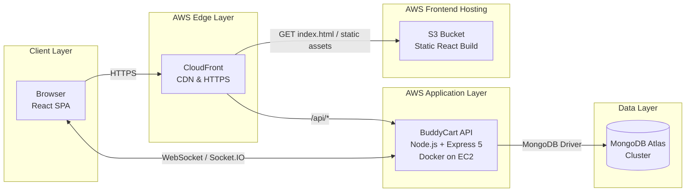
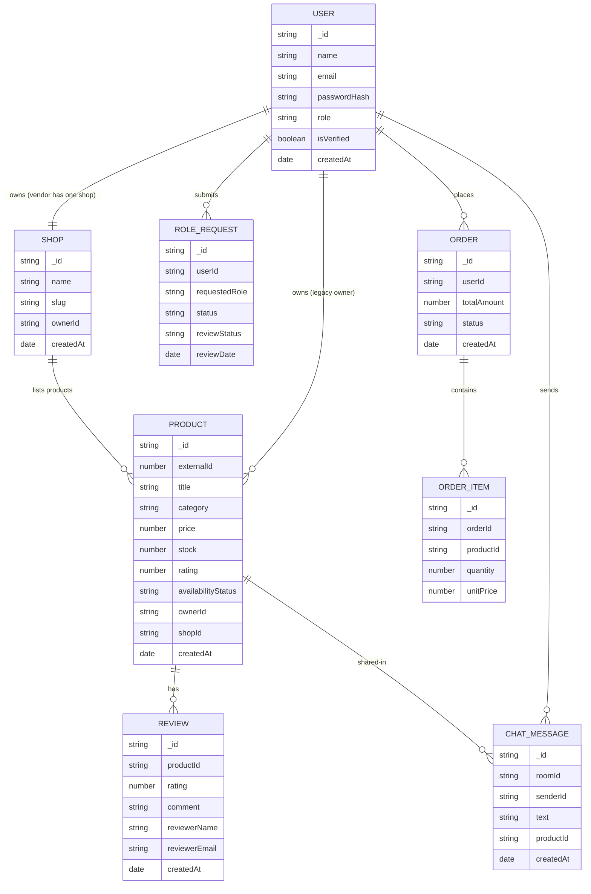
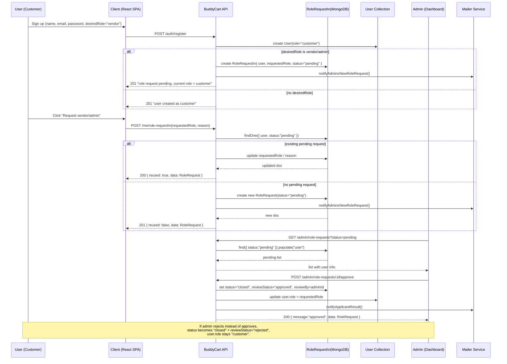

# 🛒 BuddyCart — Full-Stack E-Commerce & Real-Time Communication Platform

<!-- CI & Coverage -->

### 🌍 AWS Deployment (Frontend)

BuddyCart is a backend-first full-stack **e-commerce + real-time chat** platform designed to demonstrate
enterprise-grade architecture, clean data flow, reliable automation, and production-ready engineering.

It focuses on **secure APIs**, **authentication/authorization**, **real-time communication**, and a complete CI/CD workflow across cloud environments.

---

## 💻 Tech Stack (Production Grade)

**Frontend:** React · Context API · Fly.io  
**Backend:** Node.js (Express 5) · REST API · WebSocket (Socket.IO)  
**Database:** MongoDB Atlas (Cloud)  
**Infra / DevOps:** Docker · GitHub Actions · Render (API) · Fly.io (Client)  
**Security:** JWT Auth · RBAC · Ownership Enforcement  
**Quality:** Automated Tests · Code Coverage · Health & Readiness Probes

---

## 🚀 Features

- **JWT Authentication** (HTTP + WebSocket)
- **Role-Based Access Control** (admin / vendor / customer)
- **Product CRUD** with strict ownership validation
- **Real-Time Chat System** (`/chat` namespace with product sharing)
- **Lazy DB Seeding** on first boot
- **Modular API Architecture** (auth, products, vendor, checkout, preferences)
- **Health & Readiness Endpoints**  
  - `/health` → liveness  
  - `/ready` → MongoDB connection check

---

## 🧱 System Overview

Client (React, Fly.io)
↕ REST / WebSocket
Server (Node.js + Express 5, Render)
↕
MongoDB Atlas (Cloud Database)

- JWT validated consistently for HTTP routes and Socket.IO events  
- Controllers enforce **role + ownership** rules  
- Socket.IO propagates product updates in real time  
- CI pipeline runs tests + uploads coverage + validates build on every push  

---

## 📦 Modules

- **Auth** → registration, login, token refresh  
- **Products** → CRUD + admin overrides  
- **Chat** → live messaging, product preview sharing  
- **Vendor** → shop configuration & product ownership  
- **Checkout** → mock payment + order flow  
- **Admin** → user elevation & role request processing  

---

## 🛡 Production-Ready Engineering

- Automated CI pipeline (GitHub Actions)  
- Test coverage reporting (Codecov)  
- Dockerized backend application  
- Health & readiness probes  
- Multi-cloud deployment across **Render**, **Fly.io**, **MongoDB Atlas**  
- Environment-based configuration & secret management  

---

## 📈 Future Improvements

- End-to-End tests  
- Product recommendation logic  
- Persistent chat history  
- Optional AWS App Runner deployment  

---

## 🧱 Architecture Overview

---

## 🗄 Data Model (MongoDB Atlas)

---

## 🔁 Role Request Flow (customer → vendor/admin)

---

## 👨‍💻 Author

**Yang Yanqing (杨彦青)** — Full-Stack Developer  
📍 Berlin, Germany  
🔗 GitHub: https://github.com/Yang-Yanqing
